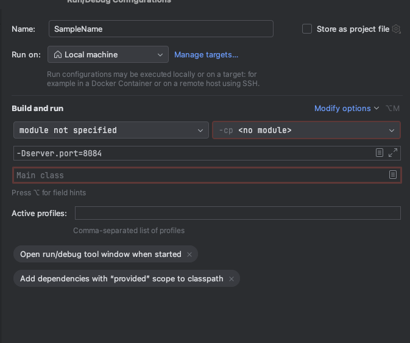

# 로컬에서 분산 서버 테스트 방법(Intellij 및 k6 기준)

## 1. Edit configurations에 들어갑니다.<br>


## 2. 좌측 상단의 + 버튼을 누른 뒤 Spring Boot를 선택합니다.<br>


## 3. 이름은 자유롭게 설정 후 우측 중간 즈음의 Modify options를 클릭 후 Add VM options를 클릭합니다.<br>


## 4. VM options에 `-Dserver.port={포트번호}`을 입력합니다.<br>



## 5. Main class란의 우측에 브라우저 버튼을 클릭 후 Project에서 `coupon/src/main/java/com/soma/coupon/CouponApplication`를 선택합니다.<br>


## 6. 좌측 상단의 + 버튼을 누른 뒤 Compound를 클릭합니다<br>


### 7. 이름은 자유롭게 설정 후 + 버튼을 눌러 그동안 만든 Spring Boot를 전부 포함시켜주면 한번에 실행할 수 있습니다.<br>


## 8. `coupon/src/main/resources/nginx.conf`파일에 로드밸런싱을 할 포트 번호 목록을 적습니다.<br>


## 9. 터미널로 `coupon/src/main/resources`로 이동 후 아래 명령어를 입력합니다.

```
docker run --name nginx-balancer -p 8080:80 -v $(pwd)/nginx.conf:/etc/nginx/nginx.conf:ro nginx
```
